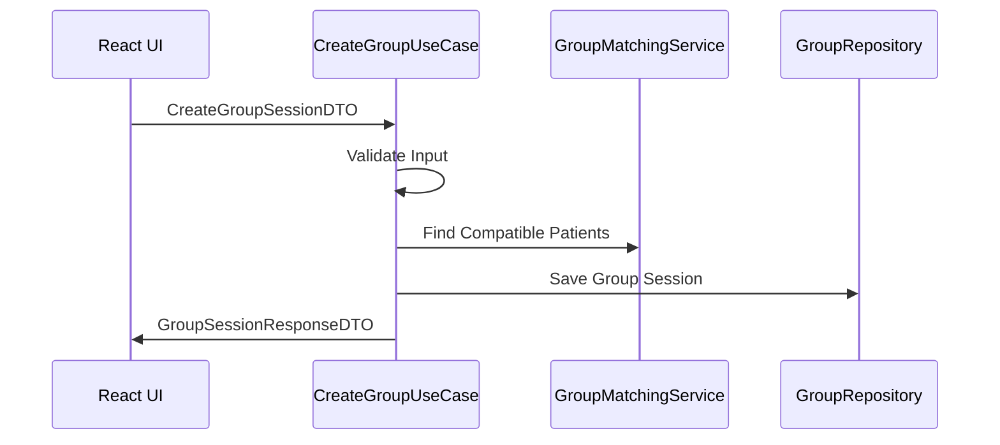
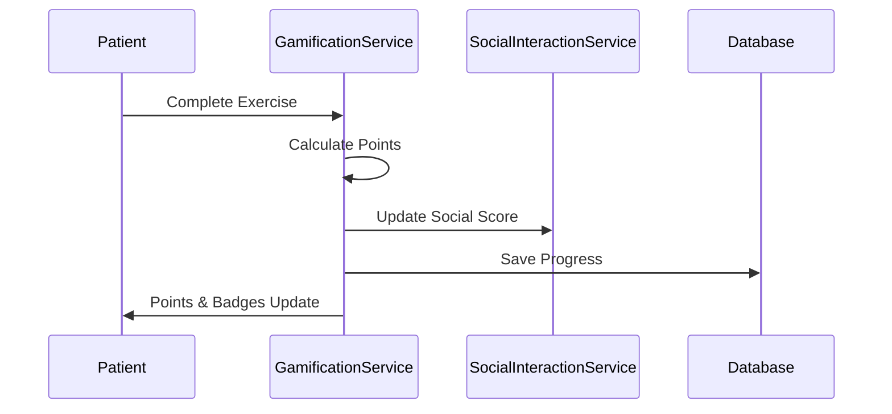
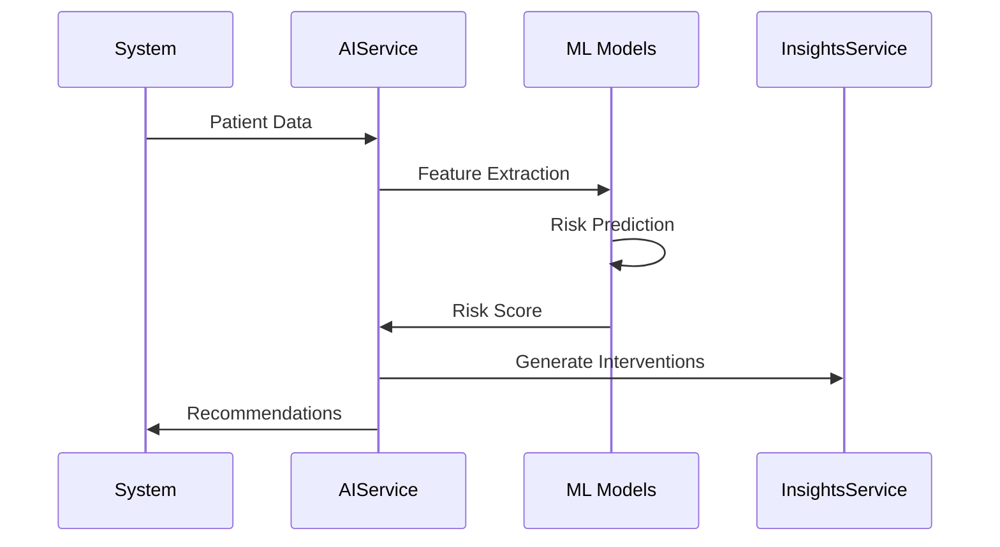

# FisioFlow - Arquitetura do Sistema

## 📋 Visão Geral

O FisioFlow é um sistema revolucionário de gestão para clínicas de fisioterapia, desenvolvido com **Clean Architecture** e **Domain-Driven Design**, focado em exercícios em grupos e gamificação social.

## 🏗️ Arquitetura Clean

### Camadas da Aplicação

```
┌─────────────────────────────────────────────────────────────┐
│                    PRESENTATION LAYER                       │
│  ┌─────────────────┐ ┌─────────────────┐ ┌────────────────┐│
│  │   React UI      │ │  API Controllers │ │   WebSockets   ││
│  │   Components    │ │   (REST/GraphQL) │ │   Real-time    ││
│  └─────────────────┘ └─────────────────┘ └────────────────┘│
└─────────────────────────────────────────────────────────────┘
                               │
                               ▼
┌─────────────────────────────────────────────────────────────┐
│                   APPLICATION LAYER                         │
│  ┌─────────────────┐ ┌─────────────────┐ ┌────────────────┐│
│  │   Use Cases     │ │      DTOs       │ │   Validators   ││
│  │   Orchestrate   │ │  Data Transfer  │ │   Input/Output ││
│  │   Business Flow │ │    Objects      │ │   Validation   ││
│  └─────────────────┘ └─────────────────┘ └────────────────┘│
└─────────────────────────────────────────────────────────────┘
                               │
                               ▼
┌─────────────────────────────────────────────────────────────┐
│                     DOMAIN LAYER                            │
│  ┌─────────────────┐ ┌─────────────────┐ ┌────────────────┐│
│  │    Entities     │ │    Services     │ │  Repositories  ││
│  │  Core Business  │ │  Domain Logic   │ │   Interfaces   ││
│  │     Rules       │ │   Algorithms    │ │   Contracts    ││
│  └─────────────────┘ └─────────────────┘ └────────────────┘│
└─────────────────────────────────────────────────────────────┘
                               │
                               ▼
┌─────────────────────────────────────────────────────────────┐
│                 INFRASTRUCTURE LAYER                        │
│  ┌─────────────────┐ ┌─────────────────┐ ┌────────────────┐│
│  │    Database     │ │  External APIs  │ │   File System  ││
│  │ PostgreSQL/Redis│ │  AI Services    │ │   Storage      ││
│  │   Supabase      │ │   Payments      │ │   Uploads      ││
│  └─────────────────┘ └─────────────────┘ └────────────────┘│
└─────────────────────────────────────────────────────────────┘
```

## 📁 Estrutura de Diretórios

```
src/
├── domain/                     # Camada de Domínio
│   ├── entities/               # Entidades de negócio
│   │   ├── patient.ts
│   │   ├── group-session.ts
│   │   ├── exercise.ts
│   │   └── gamification.ts
│   ├── repositories/           # Interfaces dos repositórios
│   │   ├── patient-repository.ts
│   │   └── group-session-repository.ts
│   └── services/               # Serviços de domínio
│       ├── gamification-service.ts
│       ├── ai-prediction-service.ts
│       └── group-matching-service.ts
├── application/                # Camada de Aplicação
│   ├── use-cases/              # Casos de uso
│   │   └── create-group-session.ts
│   └── dto/                    # Data Transfer Objects
│       └── group-session-dto.ts
├── presentation/               # Camada de Apresentação
│   └── api/
│       └── controllers/
│           └── group-controller.ts
└── infrastructure/             # Camada de Infraestrutura
    ├── database/
    ├── external-apis/
    └── storage/
```

## 🔧 Tecnologias Principais

### Frontend
- **React 19.1.1** - Interface do usuário
- **TypeScript** - Tipagem estática
- **Vite** - Build tool e dev server
- **Tailwind CSS** - Styling (implícito no design)

### Backend
- **Node.js** - Runtime
- **Drizzle ORM** - Object-Relational Mapping
- **PostgreSQL** - Banco de dados principal
- **Redis** - Cache e sessões

### AI/ML
- **Google Gemini AI** - Análise de dados
- **TensorFlow.js** - Machine Learning no cliente
- **Algoritmos proprietários** - Predição de aderência

### Deploy & DevOps
- **Vercel** - Hosting frontend
- **Supabase** - Backend as a Service
- **Docker** - Containerização
- **GitHub Actions** - CI/CD

## 🎯 Funcionalidades Core

### 1. Sistema de Exercícios em Grupos (INOVAÇÃO MUNDIAL)
```typescript
interface GroupSession {
  id: UUID;
  name: string;
  fisioterapeutaId: UUID;
  currentMembers: UUID[];
  exercises: UUID[];
  schedule: SessionSchedule;
  matchingAlgorithm: GroupMatchingService;
}
```

### 2. Gamificação Social Avançada
```typescript
interface GamificationSystem {
  pointsCalculation: PointsCalculationService;
  socialInteractions: SocialInteractionService;
  badges: BadgeSystem;
  challenges: PersonalizedChallenges;
  leaderboards: GroupLeaderboards;
}
```

### 3. IA Preditiva para Aderência
```typescript
interface AISystem {
  adherencePrediction: AdherencePredictionService;
  riskAssessment: RiskAssessmentService;
  recommendations: RecommendationEngine;
  insights: ClinicalInsightsService;
}
```

### 4. Gestão Econômica Inteligente
```typescript
interface EconomicsSystem {
  costOptimization: AIEconomicsService;
  demandPrediction: DemandForecastingService;
  resourceOptimization: ResourceManagementService;
  financialAnalytics: FinancialDashboard;
}
```

## 🔄 Fluxos Principais

### Fluxo de Criação de Grupo


### Fluxo de Gamificação


### Fluxo de IA Preditiva


## 🗄️ Modelo de Dados

### Entidades Principais

```sql
-- Pacientes
CREATE TABLE patients (
  id UUID PRIMARY KEY,
  name VARCHAR NOT NULL,
  email VARCHAR UNIQUE,
  medical_conditions TEXT[],
  gamification_profile JSONB,
  created_at TIMESTAMP DEFAULT NOW()
);

-- Sessões de Grupo
CREATE TABLE group_sessions (
  id UUID PRIMARY KEY,
  name VARCHAR NOT NULL,
  fisioterapeuta_id UUID REFERENCES users(id),
  max_capacity INTEGER,
  current_members UUID[],
  schedule JSONB,
  status VARCHAR CHECK (status IN ('active', 'paused', 'completed'))
);

-- Gamificação
CREATE TABLE user_game_profiles (
  id UUID PRIMARY KEY,
  user_id UUID REFERENCES patients(id),
  current_points INTEGER DEFAULT 0,
  level INTEGER DEFAULT 1,
  badges JSONB[],
  social_score NUMERIC DEFAULT 0
);

-- IA e Predições
CREATE TABLE adherence_predictions (
  id UUID PRIMARY KEY,
  patient_id UUID REFERENCES patients(id),
  risk_probability NUMERIC,
  risk_factors JSONB,
  interventions JSONB,
  predicted_at TIMESTAMP DEFAULT NOW()
);
```

## 🔐 Segurança

### Autenticação e Autorização
- **Supabase Auth** - Sistema de autenticação
- **Row Level Security (RLS)** - Segurança a nível de linha
- **JWT Tokens** - Autenticação stateless
- **RBAC** - Role-Based Access Control

### Proteção de Dados
- **LGPD Compliance** - Conformidade com LGPD
- **HIPAA Ready** - Preparado para HIPAA
- **Encryption at Rest** - Dados criptografados
- **TLS 1.3** - Comunicação segura

## 📊 Monitoramento e Observabilidade

### Métricas de Performance
- **Core Web Vitals** - Performance do frontend
- **API Response Times** - Latência das APIs
- **Database Query Performance** - Performance do banco
- **AI Model Accuracy** - Precisão dos modelos

### Logging e Alertas
- **Structured Logging** - Logs estruturados
- **Error Tracking** - Rastreamento de erros
- **Business Metrics** - Métricas de negócio
- **Real-time Alerts** - Alertas em tempo real

## 🚀 Escalabilidade

### Horizontal Scaling
- **Microservices Architecture** - Arquitetura de microserviços
- **Container Orchestration** - Kubernetes ready
- **Database Sharding** - Particionamento de dados
- **CDN Integration** - Content Delivery Network

### Vertical Scaling
- **Optimized Queries** - Consultas otimizadas
- **Caching Strategies** - Estratégias de cache
- **Connection Pooling** - Pool de conexões
- **Background Jobs** - Processamento assíncrono

## 🔧 Desenvolvimento

### Princípios SOLID
- **S** - Single Responsibility Principle
- **O** - Open/Closed Principle
- **L** - Liskov Substitution Principle
- **I** - Interface Segregation Principle
- **D** - Dependency Inversion Principle

### Padrões de Design
- **Repository Pattern** - Abstração de dados
- **Factory Pattern** - Criação de objetos
- **Observer Pattern** - Eventos e notificações
- **Strategy Pattern** - Algoritmos intercambiáveis

### Qualidade de Código
- **TypeScript** - Tipagem estática
- **ESLint** - Análise estática
- **Prettier** - Formatação de código
- **Jest** - Testes unitários
- **Cypress** - Testes E2E

## 📈 Performance

### Otimizações Frontend
- **Code Splitting** - Divisão de código
- **Lazy Loading** - Carregamento sob demanda
- **Image Optimization** - Otimização de imagens
- **Bundle Analysis** - Análise de bundles

### Otimizações Backend
- **Database Indexing** - Índices otimizados
- **Query Optimization** - Consultas eficientes
- **Caching Layers** - Camadas de cache
- **Compression** - Compressão de dados

---

Esta arquitetura garante que o FisioFlow seja:
- ✅ **Escalável** - Cresce com a demanda
- ✅ **Manutenível** - Fácil de manter e evoluir
- ✅ **Testável** - Cobertura de testes abrangente
- ✅ **Seguro** - Conformidade com regulamentações
- ✅ **Performático** - Resposta rápida e eficiente